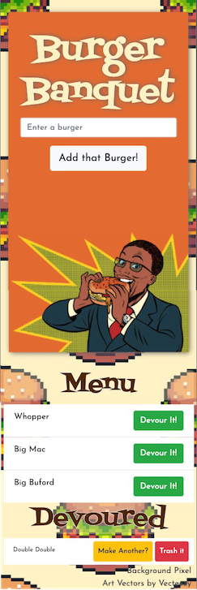

# Burger Banquet
Homework #13 Express-Handlebars: Burger Banquet

---
## Table of Contents
 * [Description](#description)
    + [Scope of Work](#scope-of-work)
    + [MySQL](#mysql)
    + [Node.js](#nodejs)
    + [Express-Handlebars](#express-handlebars)
    + [jQuery](#jquery)
    + [CSS](#css)
  * [Screenshots](#screenshots)
  * [License](#license)
  * [Credits](#credits)

## Description

### Scope of Work
The user is looking for a fun way to track Hamburgers. They want to be able to add burgers to a menu then mark them as eaten. 

### MySQL
The user's burgers are stored in a MySQL database. It is a very simple schema that consists of one table. The only things, outside of a unique ID, being tracked are a name, and if the burger has been devoured. I utilized MySQL's pool method on this app as it is built with the MVC framework. The initial connection is separate from the ORM and Model. 

### Node.js
The big lift with Node is coming via Express. I have created a simple server that only has two routes. One to route for the HTML and the other to API for the data. Inside my controller, I have opted to use the router method in express to control my routes. Also, inside my controller I am running the GET, POST, PUT, & DELETE methods for the data. It is here that I am calling the functions for the model to take care of the database manipulation as well as rendering that data to the front end via Express-Handlebars.

### Express-Handlebars
My Handlebars setup consists of the main, index, footer partial and lists partial. I utilized the index to house the large display and data input of the app. The lists that hold the users inputted data are inside their own partial. I chose to keep the lists together vs separating them into unique partials due to the fact I utilized BootStraps grid system to style them. I found it easier to just keep them together to achieve the look I was going for. Handlebars is taking care of iterating the data sent to it from the backend and rendering all of the data as HTML to the user. 

### jQuery
I chose to use jQuery for this app to take care of my event listeners and AJAX calls to the backend. There is a POST call for when the user adds a burger to the menu. Next, a PUT call that is what is toggling the table value of devoured to move the burger from one list to the other. The original request was to only move it to an eaten list but I decided to add an option for the user to move the burger from the devoured list to the eaten list. Lastly, another bonus feature added is a delete button. This is a very simple AJAX DELETE call to remove the burger from the database. With the two latter additions of code, I have given the user full CRUD control over their data. jQuery is also used for some DOM manipulation. The headings for the lists are only visible if there is data for that list. 

### CSS
The app is stylized with a mix of BootStrap and custom CSS. Bootstrap was a quick way to get a page up and looking decent but it had its limitations. Where I really like BootStrap is the grid. It was utilized heavily in the design of this page. My own CSS was added to give me more of my spin on the page elements. The app is fully mobile responsive for the users convenience.

## Screenshots

 

_App Functionality_
 

_Mobile Responsiveness_

## License
Licensed under the GNU GPLv3.0 License. Copyright © 2020

## Credits

* [Guide to Express-Handlebars](https://stackabuse.com/guide-to-handlebars-templating-engine-for-node/)

* [Better Express routing for Node JS](https://caffeinecoding.com/better-express-routing-for-nodejs/)

* [Toggle a Boolean](https://stackoverflow.com/questions/11604409/how-to-toggle-a-boolean) 

